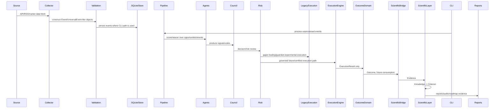

# Flow Validation

## Evidence basis

This is a static repository flow audit. It traces implemented function/module boundaries from source files and tests. It does not claim live trading correctness.

## Complete intended sequence

## One event path observed

1. `OMACLI.cmd_collect` calls `WorldMonitorV2.collect_all()`.
2. Returned events are inserted through `OMACoreDatabase.insert_event`.
3. `OMACLI.cmd_process` reads `get_unprocessed_events` and calls `Pipeline.run` from `core.engines.score_opportunity`.
4. Pipeline scores events and produces opportunity dictionaries.
5. CLI displays or exports opportunities.

## One signal/trade path observed

Legacy tests cover `TradeSignal`, `PaperTradingEngine`, risk guards, crash/knife/gap/direction controls, and performance memory. Governed Sprint 15A-15E tests separately cover `ExecutionSignal -> ExecutionRequest -> ExecutionResult`, ledger/state, and Outcome Collector.

There is no single proven end-to-end function call sequence that connects collector output through council, risk, new Execution Engine, Outcome Domain, Scientific Bridge, and Knowledge in one production path.

## One learning cycle observed

Scientific modules include outcome bridge/evaluator, knowledge extractor, criterion candidate generator, stores, lifecycles, and tests. Current code supports experimental learning flows, but canonical architecture now requires Outcome Domain -> Scientific Bridge -> Evidence before Knowledge/Criterion. Some scientific code likely predates that governance and should be re-certified or quarantined.

## Flow verdict

The repository has many working local flows, but the complete canonical OSIRIS loop is not production-proven as one orchestrated, observable, risk-gated, restart-safe pipeline.
